# Ginmill


[](https://pkg.go.dev/github.com/ginmills/ginmill)


**Ginmill** is a modular route composition tool for the **Gin** web framework.

It decouples **route definitions** from **handler implementations**, allowing developers to build standard-compliant, reusable API modules ("Features") that can be plugged into any Gin server.

---

## 🎯 Project Goal

The primary goal of Ginmill is to enable **"Write Once, Reuse Everywhere"** for API specifications.

Instead of rewriting the same `router.GET` and `router.POST` boilerplate for every project, Ginmill allows you to:

1.  **Define** a set of routes in a shared library (e.g., a "Mastodon API" package).
2.  **Declare** a Go `interface` for the business logic.
3.  **Implement** the interface in your specific application.
4.  **Compose** the server by loading the feature.

This is particularly useful for:

- Implementing standard protocols (OAuth, ActivityPub, etc.).
- Building microservices with shared API contracts.
- Keeping `main.go` clean and focused on composition.

---

## 🏗 Architecture

Ginmill acts as the bridge between the raw Gin engine, route specifications, and your application logic.

```mermaid
graph TD
    subgraph Core ["Ginmill Internal"]
        G[Gin Engine]
        GM[Ginmill Server]
    end

    subgraph Feature ["Reusable Feature Package (aka a ginmill 🍸)"]
        FD[Feature Definitions]
        I[Handler Interface]
        R[Route Rules]
    end

    subgraph App ["Your Application"]
        Consumer[Main Application]
        Impl[Logic Implementation]
    end

    Consumer -->|1. Initializes| GM
    GM -->|2. Wraps| G

    FD -->|Defines| I
    FD -->|Contains| R

    Consumer -->|3. Imports| FD
    Impl -->|4. Implements| I

    GM -->|5. Loads .With| FD
    FD -.->|Binds to| Impl

    %% Styling
    style G fill:#e0f7fa,stroke:#006064
    style GM fill:#bbdefb,stroke:#0d47a1
    style FD fill:#fff9c4,stroke:#fbc02d
    style Consumer fill:#d1c4e9,stroke:#4527a0
```



### Roles

1.  **Gin Engine**: The underlying HTTP web server.
2.  **Ginmills Interfaces**: The contract. It defines _what_ routes exist and _what_ methods must be implemented, but not _how_.
3.  **App Developer**: Focuses solely on implementing the interface logic (database queries, business rules) and injecting dependencies.

---

## 🚀 Usage Examples

### 1. Basic Example: Cheers 🍻

A simple feature that adds a celebratory endpoint.

**Feature Definition (Library Side):**

```go
package cheers

import (
	"github.com/gin-gonic/gin"
	"github.com/ginmills/ginmill"
)

// 1. Define the interface
type ICheers interface {
	SayCheers(c *gin.Context)
}

// 2. Export the feature
func Features(h ICheers) *ginmill.Features {
	r := gin.New()

	// Define routes on a temporary group
	r.GET("/cheers", h.SayCheers)

	// Return as a reusable Ginmill Feature
	return ginmill.NewFeatures(r.Routes())
}
```

**Application Implementation (Your App):**

```go
package main

import (
	"net/http"
	"github.com/gin-gonic/gin"
	"github.com/ginmills/ginmill"
	"path/to/cheers" // Import the feature
)

// 1. Implement the interface
type MyCheers struct{}

func (m *MyCheers) SayCheers(c *gin.Context) {
	c.String(http.StatusOK, "Cheers! 🍻 from Ginmill")
}

func main() {
	engine := gin.New()
	server := &ginmill.Server{Engine: engine}

	// 2. Instantiate logic
	myLogic := &MyCheers{}

	// 3. Load the feature
	server.With(cheers.Features(myLogic))

	engine.Run(":8080")
}
```

---

### 2. Advanced Example: Mastodon API 🐘

Implementing a standardized OAuth flow where the routes are complex but the contract is clear.

**Feature Definition:**

```go
package mastodon

import (
    "github.com/gin-gonic/gin"
    "github.com/ginmills/ginmill"
)

// The Contract
type IMastodon interface {
    GetStatus(c *gin.Context)
    PostStatus(c *gin.Context)
}

// The Route Bundle
func Features(impl IMastodon) *ginmill.Features {
    r := gin.New()
    v1 := r.Group("/api/v1")
    {
        v1.GET("/statuses/:id", impl.GetStatus)
        v1.POST("/statuses", impl.PostStatus)
    }
    return ginmill.NewFeatures(r.Routes())
}
```

**Application Usage:**

```go
package main

import (
    "github.com/gin-gonic/gin"
    "github.com/ginmills/ginmill"
    "github.com/ginmills/mastodon" // Imaginary reusable package
)

type MyInstance struct {
    // Database connection, etc.
}

func (m *MyInstance) GetStatus(c *gin.Context) {
    id := c.Param("id")
    c.JSON(200, gin.H{"id": id, "content": "Hello World"})
}

func (m *MyInstance) PostStatus(c *gin.Context) {
    // Logic to save status
    c.Status(200)
}

func main() {
    r := gin.Default()
    s := &ginmill.Server{Engine: r}

    // Plug in the Mastodon features
    s.With(mastodon.Features(&MyInstance{}))

    r.Run()
}
```

---

## 📦 Installation

```bash
go get github.com/ginmills/ginmill
```

## 🤝 Contribution

Contributions are welcome! Please submit a Pull Request.

**License**: MIT
